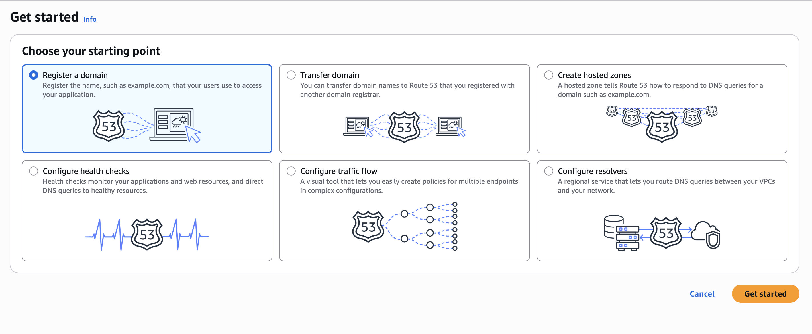
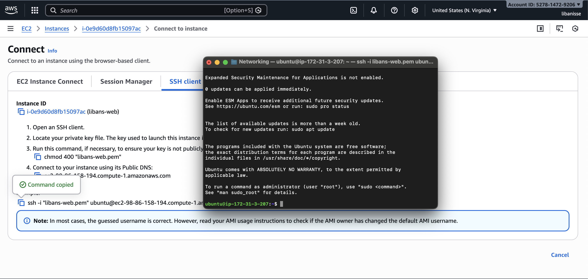
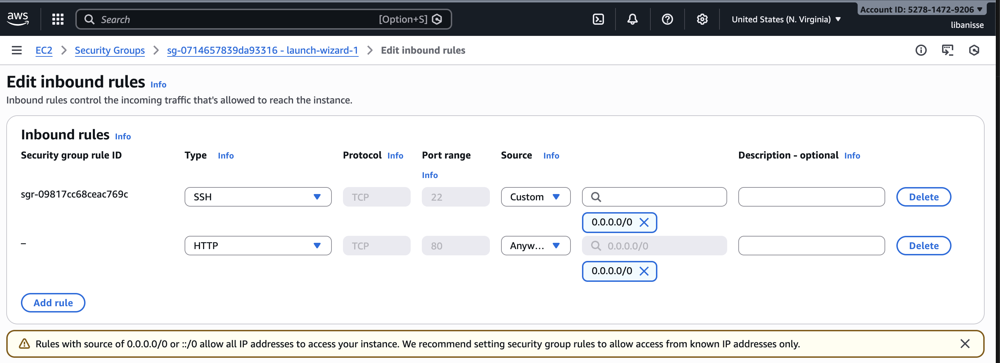
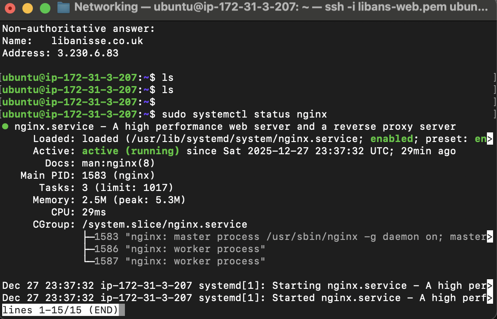
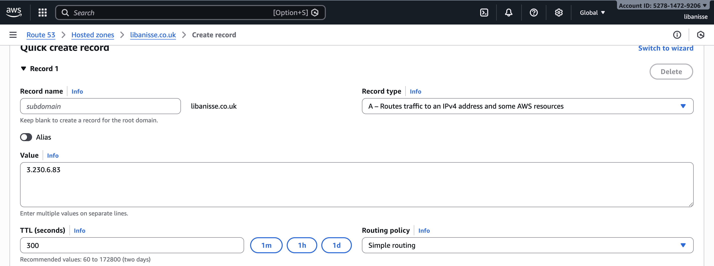
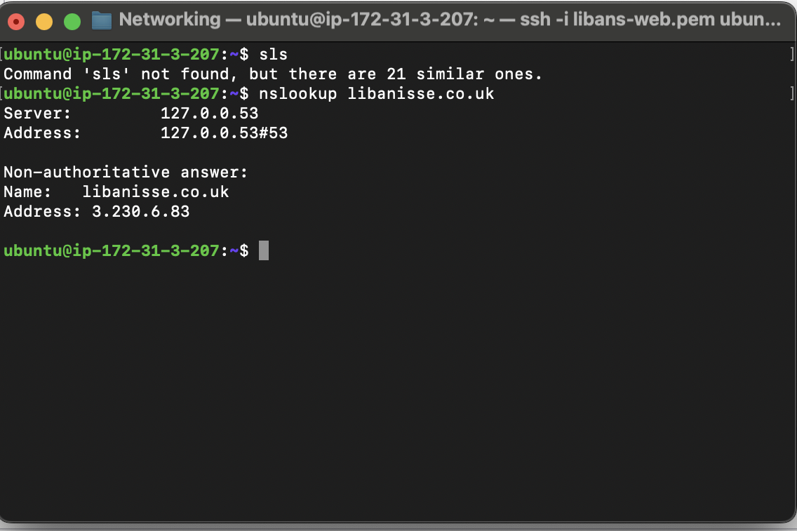
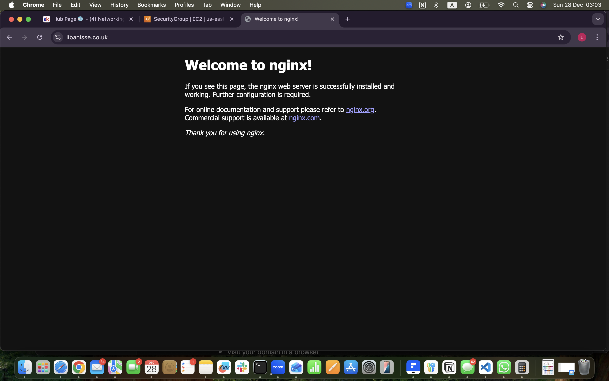

# Networking Assignment

## Core Assignment: Domain + EC2 + DNS NGINX

## Objective
- Register a domain
- Launch an EC2 instance
- configure to correct security group
- Install and run NGINX
- Configure DNS (A record) to point the domain to the EC2 public IPv4 address
- Confirm the site loads in a browser

### 1. Registering a domain

I went to AWS Route 53 and registered a domain.

**Domain:** `libanisse.co.uk`
**Website:** https://www.libanisse.co.uk

### 2. Launch an EC2 instance + connect with SSH

Next, I launched an EC2 instance (Ubuntu) and created a new key pair so I could securely connect to the server.

### 3. Security group

I updated my EC2 Security Group inbound rules to allow HTTP traffic on port 80, so the NGINX website can be accessed from the internet.

### 4. Commands used for NGINX
- sudo apt update
- sudo apt install -y nginx

- sudo systemctl start nginx
- sudo systemctl enable nginx

- sudo systemctl status nginx --no-pager

### 5. Elastic IP

I allocated and associated an Elastic IP with my EC2 instance so the server keeps
the same public IP address.

### 6. Configure DNS

I created an A record for my domain and pointed it to my EC2 Elastic IP address,
so the domain resolves to my server.

After creating the A record, I verified the domain resolves to my
EC2 Elastic IP using nslookup libanisse.co.uk

### 7. Load the NGINX default page

Once DNS was configured and NGINX was running, I successfully accessed my EC2 server through my domain and saw the default NGINX welcome page.

